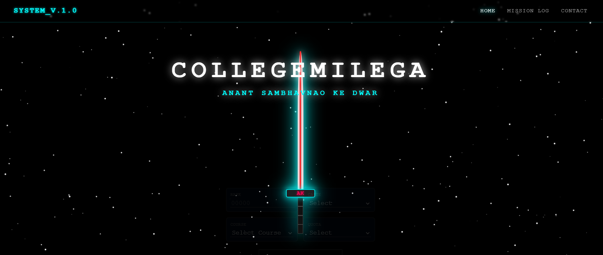
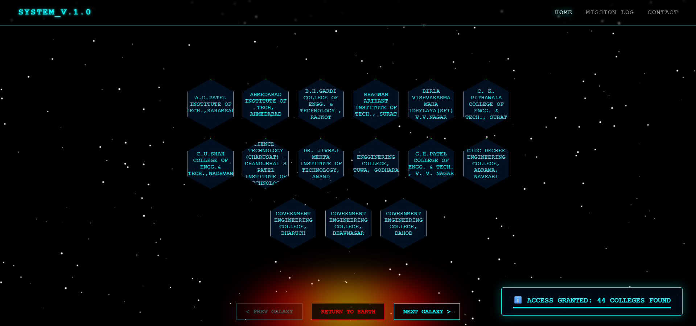
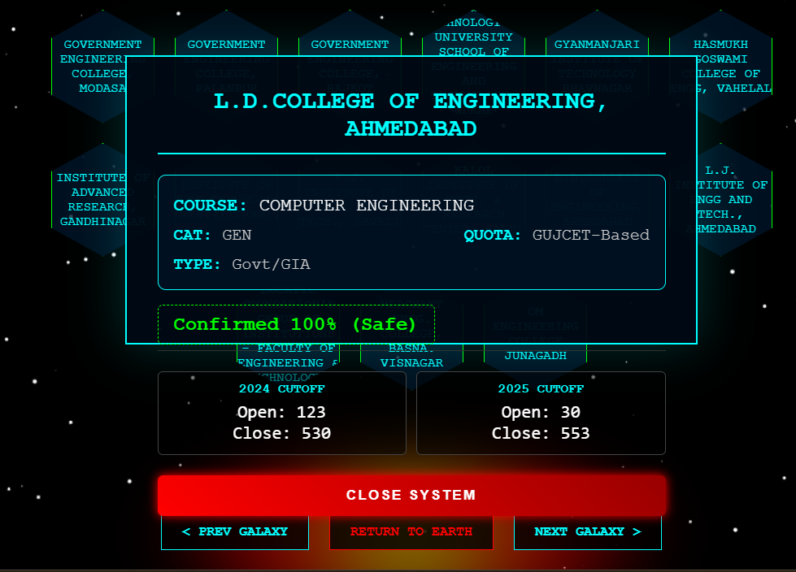

# 🚀 CollegeMilega - Next-Gen Admission Intelligence
> *Anant Sambhavnao Ke Dwar (Gateway to Infinite Possibilities)*

---

## 🌌 Overview
**CollegeMilega** is a futuristic, data-driven career guidance platform engineered to simplify the complex engineering admission process. 

Unlike traditional static lists, this system acts as an **Intelligent Expert System**, analyzing historical cutoff trends (2024 & 2025) to predict admission probabilities with high precision. Wrapped in an immersive **Sci-Fi/Space interface**, it transforms a stressful search process into an engaging mission.

---

## 🧠 The Core Intelligence: "Diamond Logic"
The system utilizes a proprietary filtering algorithm designed to eliminate false hope and provide realistic guidance.

| Prediction Zone | Visual Indicator | Probability | Strategic Advice |
| :--- | :---: | :---: | :--- |
| **SAFE ZONE** | 🟢 **Green Hexagon** | **100% Confirmed** | User rank clears cutoffs for **BOTH** 2024 & 2025. Highly recommended for choice filling. |
| **RISKY ZONE** | 🟠 **Orange Hexagon** | **50-50 Borderline** | User rank clears cutoff in **ONLY ONE** year. Should be kept as backup options. |
| **FILTERED** | ❌ **Hidden** | **< 10% Chance** | Colleges with low probability are automatically removed to reduce clutter. |

---

## 🛠️ Technology Stack
Designed for speed, scalability, and visual impact.

* **Frontend Architecture:** * **Core:** HTML5, CSS3 (Advanced Glassmorphism & Neon Effects).
    * **Logic:** Vanilla JavaScript (ES6+).
    * **Audio Engine:** Dynamic Sound Feedback (`Shoot.wav`, `Sci-Fi.wav`) for interactive UX.
    * **Visuals:** HTML5 Canvas (Starfield Animation) & CSS Keyframes.

* **Backend & Data:**
    * **Runtime:** Node.js (Serverless Architecture).
    * **Database:** **PostgreSQL (via NeonDB)** – Cloud-native serverless SQL.
    * **API:** RESTful endpoints deployed via **Netlify Functions**.

---

## 📸 System Visuals

### 1. The Warp Interface (Landing)
*A minimalistic, high-tech entry point featuring a dynamic energy sword animation.*

### 2. The Galactic Grid (Data Visualization)
*Results are rendered as a honeycomb grid floating in space, offering a unique browsing experience.*

### 3. Holographic Analysis (Deep Dive)
*Clicking a node opens a detailed HUD showing exact cutoff comparisons for multiple years.*

---

## 🚀 Key Features
* **🚫 Smart Exclusion Logic:** Automatically filters out irrelevant categories (e.g., if a user selects 'GEN', the system intelligently excludes 'GEN-PH' or 'GEN-EWS' to prevent data duplication).
* **🔊 Immersive Audio Feedback:** Every interaction—from typing to clicking—has a distinct sound signature, creating a game-like feel.
* **📜 Mission Log (Guidance Manual):** A built-in terminal that educates users on how to interpret the data strategically.
* **💳 Holographic Contact Card:** A next-gen profile card with scanning animations for developer connection.

---

## 👨‍💻 Developer Directive
**Architect:** AKASH MAURYA  
**System Status:** Online 🟢  
**Objective:** Revolutionizing EdTech with Design & Data.

> *"Bhavishya Tumhara Intezaar Kar Raha Hai.."*
